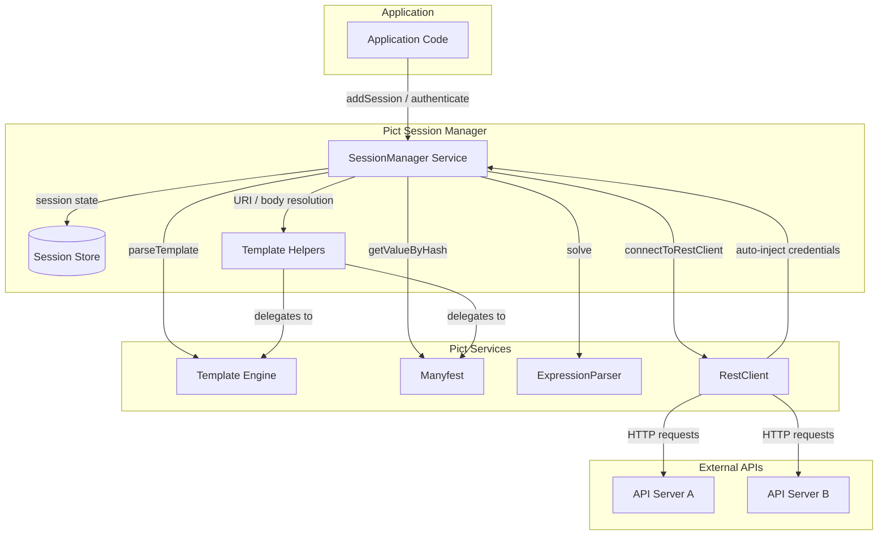
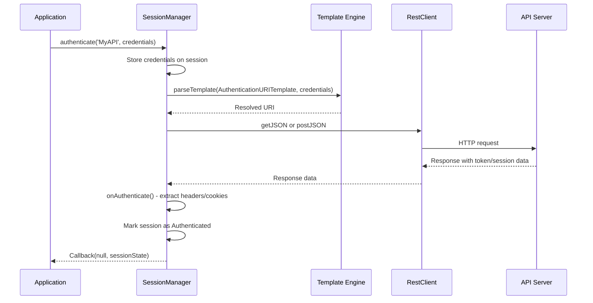
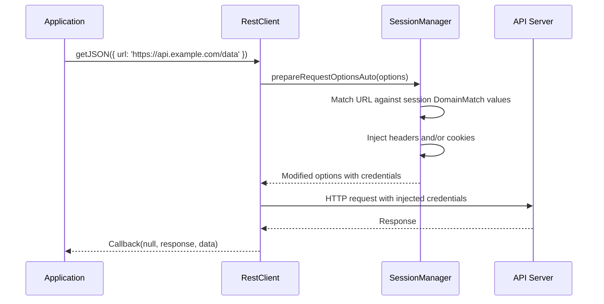
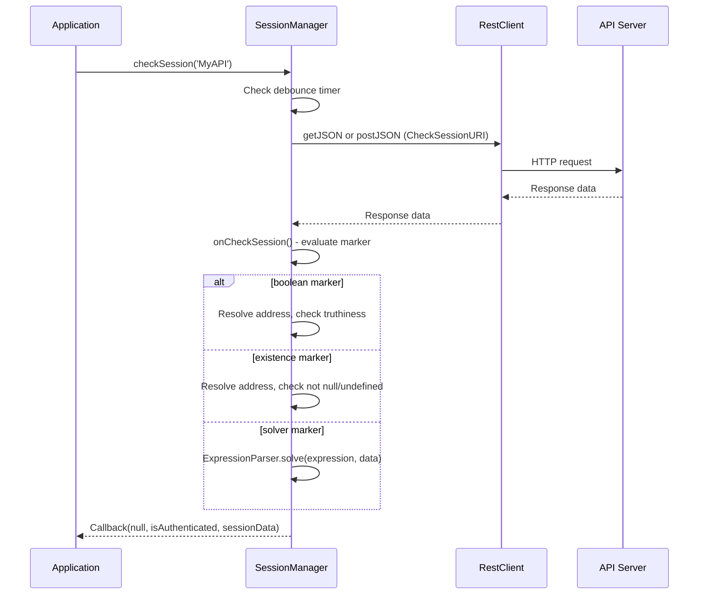

# Architecture

Pict Session Manager is a Fable service provider that manages authenticated REST sessions. It sits between your application code and the Fable REST client, intercepting outgoing requests and injecting the appropriate session credentials.

## System Overview



## Data Flow

### Authentication Flow

When `authenticate()` is called, the session manager resolves the authentication URI template, makes the authentication request, and extracts session credentials from the response.



### Credential Injection Flow

When connected to a RestClient, every outgoing request passes through the session manager. The URL is matched against configured domain patterns, and matching session credentials are injected.



### Session Check Flow

Session checks verify that an existing session is still valid by making a configured request and evaluating the response.



## Service Provider Pattern

Pict Session Manager extends `fable-serviceproviderbase`, which means it registers with a Fable/Pict instance through dependency injection. This gives it access to:

| Service | Usage |
|---------|-------|
| `this.pict` (alias for `this.fable`) | The Pict instance that owns this service |
| `this.pict.parseTemplate()` | Resolves `{~D:Record.Key~}` template expressions |
| `this.pict.manifest.getValueByHash()` | Traverses objects using dot-notation addresses |
| `this.pict.ExpressionParser.solve()` | Evaluates arithmetic expressions against data |
| `this.pict.RestClient` | Makes HTTP requests (GET, POST with JSON) |
| `this.log` | Structured logging via the Fable log service |

## Session State Object

Each named session maintains a state object with the following structure:

```javascript
{
	Name: 'MyAPI',                   // Session name
	Configuration: { ... },          // Merged configuration (defaults + user config)
	Authenticated: false,            // Whether the session is currently authenticated
	SessionData: {},                 // Data returned from authentication or session check
	Cookies: {},                     // Cookie name-value pairs for injection
	Headers: {},                     // Header name-value pairs for injection
	AuthenticateInProgress: false,   // Guard against concurrent authentication
	LastCheckTime: 0                 // Timestamp of last session check (for debounce)
}
```

## Extensibility

The session manager provides several overridable methods for customization:

| Method | Purpose |
|--------|---------|
| `onCheckSession(pSessionState, pResponse, pData)` | Custom logic for evaluating session check responses |
| `onAuthenticate(pSessionState, pResponse, pData)` | Custom logic for extracting credentials from authentication responses |
| `onPrepareHeaders(pSessionState, pOptions)` | Custom header injection logic |
| `onPrepareCookies(pSessionState, pOptions)` | Custom cookie injection logic |

To customize, extend `PictSessionManager` and override the methods:

```javascript
const libPictSessionManager = require('pict-sessionmanager');

class MySessionManager extends libPictSessionManager
{
	onAuthenticate(pSessionState, pResponse, pData)
	{
		// Call default behavior
		super.onAuthenticate(pSessionState, pResponse, pData);

		// Add custom post-auth logic
		if (pData && pData.RefreshToken)
		{
			pSessionState.SessionData.RefreshToken = pData.RefreshToken;
		}
	}
}
```
